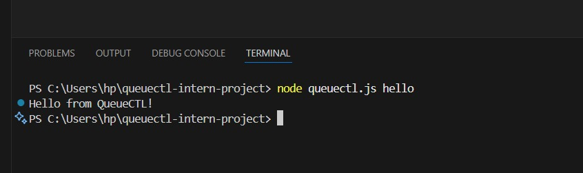
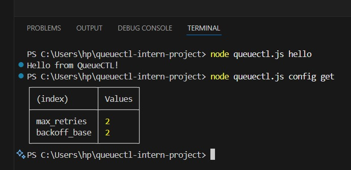
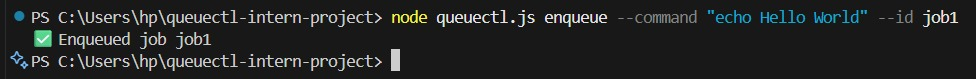
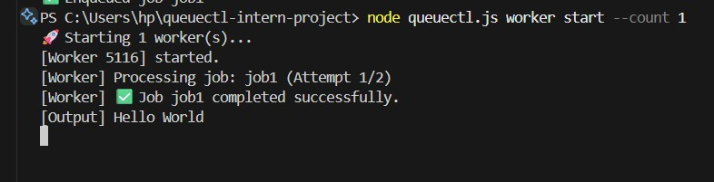
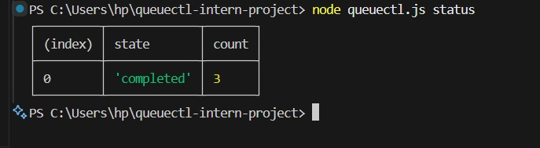
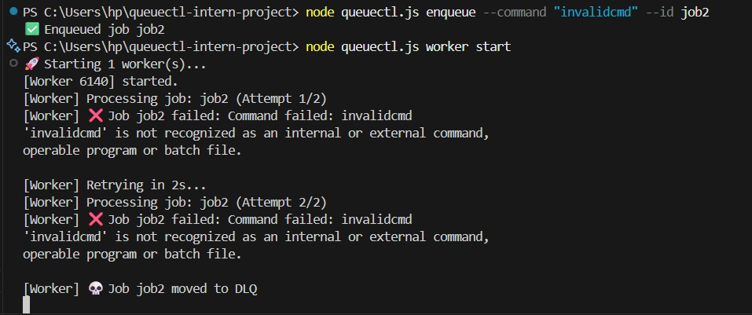
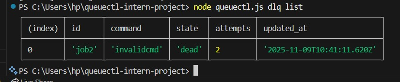
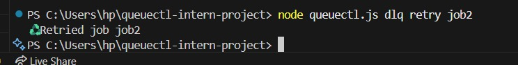
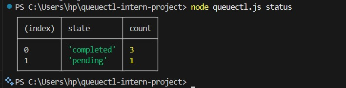
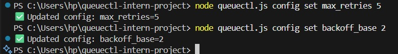

# 🚀 QueueCTL — CLI-Based Background Job Queue System

A minimal, production-style background job queue with a clean CLI, retry + exponential backoff, DLQ, and persistent storage.

> **Tech Stack:** Node.js (v18+) · SQLite (persistent local DB) · Yargs (CLI)  
> **Storage:** Local file `queue.db`

---

## 📚 Table of Contents
- [🎯 Objective](#-objective)
- [🧩 Architecture Overview](#-architecture-overview)
  - [Core Components](#core-components)
  - [Job Lifecycle](#job-lifecycle)
- [🧰 Setup](#-setup)
  - [Clone & Install](#1️⃣-clone--install)
  - [Quick Init](#2️⃣-quick-init)
  - [Verify Config](#3️⃣-verify-config-optional)
- [💻 Usage Examples (Test Scenarios)](#-usage-examples-test-scenarios)
- [⚙ Configuration](#-configuration)
- [🧱 Testing Script (Optional for Demo Video)](#-testing-script-optional-for-demo-video)
- [🧠 Assumptions & Trade-offs](#-assumptions--trade-offs)
- [🧾 Evaluation Checklist](#-evaluation-checklist)
- [🌟 Future Enhancements](#-future-enhancements)
- [🎥 Demo Video (Recommended)](#-demo-video-recommended)
- [🤝 Contributing](#-contributing)
- [📝 License](#-license)
- [👨‍💻 Author](#-author)

---

## 🎯 Objective
Build a CLI-based background job queue system called **`queuectl`**.

This system:
- Manages background jobs using worker processes
- Retries failed jobs automatically using **exponential backoff**
- Moves permanently failed jobs to a **Dead Letter Queue (DLQ)**
- Persists jobs across restarts using **SQLite** storage

---

## 🧩 Architecture Overview

### Core Components

| File                | Purpose                                                                 |
|---------------------|-------------------------------------------------------------------------|
| `config.js`         | Loads & saves configuration (`max_retries`, `backoff_base`)             |
| `db.js`             | Handles job persistence, locking, and queries using SQLite              |
| `worker.js`         | Executes jobs, handles retries, exponential backoff, and DLQ            |
| `worker_process.js` | Initializes DB and starts a worker loop in a new process                |
| `queuectl.js`       | **CLI entry point** — defines commands like `enqueue`, `list`, `worker` |

### Job Lifecycle

| State       | Description                          |
|-------------|--------------------------------------|
| `pending`   | Waiting to be processed              |
| `processing`| Currently being executed             |
| `completed` | Executed successfully                |
| `failed`    | Failed but retryable                 |
| `dead`      | Moved to DLQ after max retries       |

> **Backoff formula:** `delay = backoff_base ^ attempts` (in seconds)

---

## 🧰 Setup

### 1️⃣ Clone & Install

```bash
git clone https://github.com/dharalakshmi/queuectl-intern-project.git
cd queuectl
npm install
````

---

### 2️⃣ Quick Init

```bash
node queuectl.js hello
```


**Expected Output:**

```
Hello from QueueCTL!
```

---

### 3️⃣ Verify Config (Optional)

```bash
node queuectl.js config get
```

**Expected Default Output:**

| (index)      | Value |
| ------------ | ----- |
| max_retries  | 3     |
| backoff_base | 3     |

---

## 💻 Usage Examples (Test Scenarios)

### 🧪 Test 1 — Enqueue a Basic Job

```bash
node queuectl.js enqueue --command "echo Hello World" --id job1
```

**Output:**

```
✅ Enqueued job job1
```

---

### 🧪 Test 2 — Start a Worker

```bash
node queuectl.js worker start --count 1
```

**Output:**

```
🚀 Starting 1 worker(s)...
[Worker 12345] Processing job: job1
[Worker] ✅ Job job1 completed successfully.
[Output] Hello World
```

---

### 🧪 Test 3 — Check Job Status

```bash
node queuectl.js status
```

**Output:**

**Job Status Summary:**

| State     | Count |
| --------- | ----- |
| completed | 1     |

---

### 🧪 Test 4 — Simulate a Failed Job

```bash
node queuectl.js enqueue --command "invalidcmd" --id job2
node queuectl.js worker start
```

**Output:**

```
[Worker] Processing job: job2 (Attempt 1/3)
[Worker] ❌ Job job2 failed: spawn invalidcmd ENOENT
[Worker] Retrying in 3 seconds...
[Worker] ❌ Job job2 failed again
[Worker] Retrying in 9 seconds...
[Worker] 💀 Job job2 moved to DLQ
```

---

### 🧪 Test 5 — View Dead Letter Queue

```bash
node queuectl.js dlq list
```

**Output:**

**Dead Letter Queue (1):**

| id   | command    | state | attempts |
| ---- | ---------- | ----- | -------- |
| job2 | invalidcmd | dead  | 3        |

---

### 🧪 Test 6 — Retry a DLQ Job

```bash
node queuectl.js dlq retry job2
```

**Output:**

```
♻ Retried job job2
```

---

### 🧪 Test 7 — Check Persistence

Stop and restart your terminal, then run:

```bash
node queuectl.js status
```

You’ll still see the previous jobs — data is persisted in `queue.db`.

---

## ⚙ Configuration

Change retry or backoff base values:

```bash
node queuectl.js config set max_retries 5
node queuectl.js config set backoff_base 2
```
---

## 🧠 Assumptions & Trade-offs

| Area                | Decision                                | Reason                                               |
| ------------------- | --------------------------------------- | ---------------------------------------------------- |
| Persistence         | SQLite (instead of JSON)                | Ensures locking, concurrency, and durability         |
| Concurrency Control | `BEGIN IMMEDIATE` + `UPDATE lock`       | Prevents multiple workers picking the same job       |
| Retry Strategy      | Exponential backoff (`base ^ attempts`) | Matches production queue systems like Celery/Sidekiq |
| Worker Stop         | Manual (`Ctrl + C`)                     | Simplifies process management                        |
| Timeout Handling    | Not implemented                         | Optional for future expansion                        |

---

## 🧾 Evaluation Checklist

✅ Enqueue command
✅ Multiple worker support
✅ Exponential backoff
✅ DLQ implemented
✅ Persistent storage (SQLite)
✅ Configurable retries/backoff
✅ Job status/list commands
✅ Modular code structure
✅ Readable logs
✅ Comprehensive README (this file)

---

## 🌟 Future Enhancements

* Add `queuectl worker stop` with PID management
* Implement job priority queues
* Add delayed/scheduled jobs (`run_at` timestamp)
* Implement per-job timeout
* Add a lightweight monitoring dashboard (CLI or Web UI)

---

## 🎥 Demo Video

🎬 Recorded a short video showing:

1. Enqueue a few jobs (valid + invalid)
2. Start workers
3. Show retries and DLQ
4. Run `queuectl status` and `queuectl dlq list`
5. (Optional) Retry DLQ job

**📹 Demo Video:** [Watch Here](https://drive.google.com/file/d/166IKlVt_o05jAVkxm5R4h1JoJlaM9RIH/view?usp=drivesdk)

## 👨‍💻 Author

**Dhara Lakshmi Kusumanchi**
B.Tech — Amrita Vishwa Vidyapeetham


